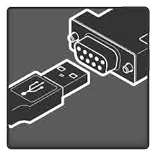
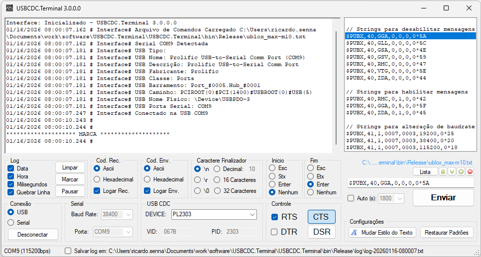

----
  
  
  
    
  
  # ** USBCDC.Terminal.exe **
  
  Terminal para comunicação com dispositivos USB CDC e seriais.
  
----
  
 ## Histórico de Revisões  
  
 | Revisão | Data | Autor | Descrição |
 |---------|------|-------|-----------|
 | 3.0 | 15/01/2026 | RS | Simplificado, refatorado e reiniciado |
 
 
 ## Compilação e IDE 
  
  Microsoft Visual Studio Community 2022 (64-bit) Version 17.14.8 
  Microsoft Visual C# Tools 4.14.0-3.25326.11+bd4f2062291278e0df1e3fd3180c0c862495a3a7 
  Microsoft .NET Framework Version 4.8.09221
  
 ## Introdução  
  
  O USBCDC.Terminal.exe é um software terminal para receber e enviar dados a dispositivos seriais e possui integração para conexão rápida e automática com conversores USB-Serial (CDC).
  
  Recursos:
  
  * Permite conectar serias USB e comuns;
  * detecção e conexão automática para dispositivos USB CDC cadastrados;
  * gravar log com dados enviados e recebidos;
  * acionar e ver estado dos IOs de controle (CTS, RTS, DSR e DTR);
  * escolher caracteres de inicio e finalização de mensagens;
  * envio automático de dados;
  * abrir e editar lista de comandos;
  * alterar fonte (textos);
    
  
 ## Dependências  
  
  O USBCDC.Terminal.exe roda em windows com base na .NET Framework 4.8.  
  
  
## Tela Principal:  
  
    
  
  
 
----
  